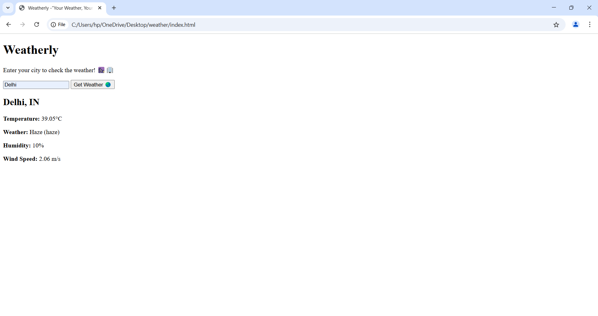
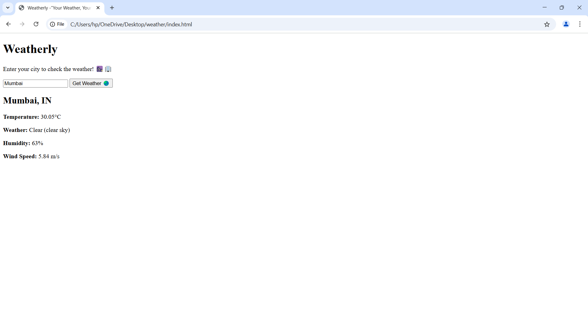

# Weatherly - "Your Weather, Your Way" 🌦️
Weatherly is a simple and interactive weather app that allows users to check the weather for any city across the globe. Simply enter a city name, and Weatherly will display the current weather, temperature, humidity, wind speed, and more.

## Features 🚀
Search for Weather: Enter any city name to get real-time weather updates.

Responsive UI: A modern and clean interface with a gradient background animation.

Weather Details: Displays temperature (in Celsius), weather conditions, humidity, and wind speed.

## Technologies Used 🛠️
HTML: For structuring the web page.

CSS: For styling the app, including the gradient background and modern UI elements.

JavaScript: For fetching data from the OpenWeather API and displaying it dynamically.

OpenWeather API: Provides real-time weather data.

## How to Use 🌍
Open the index.html file in your browser.

Enter the name of a city in the input box.

Click the "Get Weather 🌏" button.

View the weather details displayed below the input box.

## Screenshots 📸

